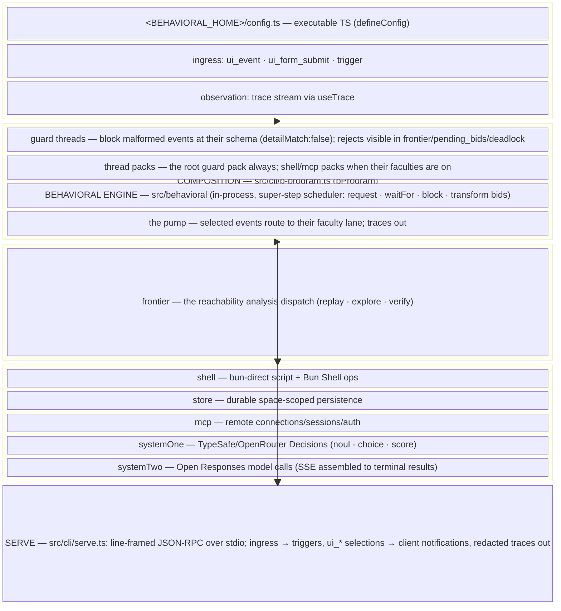

# @behavioral/sh

A behavioral agent harness. The engine is an in-process behavioral-programming
interpreter; capability faculties run as processes behind one faculty event
wire; hosts drive the runtime through a `ui_*` egress/ingress vocabulary; and
validation lives in guard threads whose rejects are visible in the traces.

The defining inversion: **there is no imperative agent loop.** Whatever looks
like an agent — turn-taking, tool use, self-improvement — is declared as
behavioral threads (request / waitFor / block / transform bids on events) that
the engine's super-step scheduler interprets. Hosts attach ingress through
`trigger`, observe through the trace stream, and own the process lifecycle.

## Architecture



**One wire.** Every faculty speaks the same behavioral event vocabulary
(`faculties.types.ts` + `faculties.constants.ts` — one home for every
request/result kind, schema, and validator): requests in as one JSON line,
results out as one JSON line, `space` preserved end to end. The engine itself is
generic over events and never imports the wire.

**Faculties are processes.** Spawned per wiring (per space) via `useFaculty`:
isolated by OS construction, killable as a process tree, respawned on demand,
crash-synthesized as exactly one `faculty_error` re-entry. The pump discards
only what cannot be this lane's event; a parsed-but-invalid result never
vanishes — it re-enters the engine and is observable in the traces. The
system faculties' guards block such a result outright (visible in the
frontier/deadlock traces); the default faculties (shell/store/mcp) surface it
as a selected-but-unmatched event. Guarding the default lanes is a recorded
follow-up.

**System faculties are endpoint-carrying overrides.** `systemOne` and `systemTwo`
have no defaults: without an endpoint they are simply absent — no process, no
route. The config surface (`configSystemOne(respond)`/`configSystemTwo(respond)`
for a custom provider entry, `useSystemOne({ endpoint })`/`useSystemTwo({ endpoints })`
for the host) delivers endpoint config via environment data; secrets never cross
the wire.

**Validation is threads, not middleware.** Guard threads derive from the same
schemas `useFaculty` compiles and returns; the controller and the JSON-RPC codec
are dumb relays. A malformed event is never selected — it is blocked, and the
reject is observable in the frontier, the pending bids, and the deadlock traces.

## Repository Map

- `src/behavioral/` — the pure language layer: types, constants, the
  interpreter core and its trace stream
- `src/faculties/` — the process layer. Shared at the top (the wire,
  `useFaculty`, the process lane, the home); one folder per faculty:
  `shell/ store/ mcp/ frontier/ system-one/ system-two/` — faculty, threads,
  types/schemas, and colocated tests
- `src/cli/` — the composition (`b-program.ts`), `init` (config generation),
  `serve` + the JSON-RPC codec, `load-config`, the trace consumer
- `src/controller/` — the browser Controller (a dumb relay), its `ui_*`
  vocabulary, and the AJV detail schemas hosts/threads use
- `src/utils/` — shared pure utilities
- `bin/behavioral.ts` — the CLI entry (`behavioral init`, `behavioral serve`)
- `skills/` — published reference skills · `.agents/skills/` — workspace
  installed skills
- `AGENTS.md` — the working law of the repo

## Public API

Imported as `@behavioral/sh`:

```ts
// The config helper — what a <home>/config.ts default-exports
// (types it accepts: the bProgram options)
import { defineConfig } from '@behavioral/sh'

// The faculties surface — what a config.ts composes with:
// useFaculty, the Faculty union, wire types + schemas/validators,
// the override thread packs (shellThreads, mcpThreads),
// and the System One/Two config surface
import { useSystemOne, useSystemTwo } from '@behavioral/sh/faculties'

// Controller — browser-side controller bootstrap
import { Controller } from '@behavioral/sh/controller'

// Utils — keyMirror, deepEqual, isTypeOf, trueTypeOf, ueid, case conversion, escape, wait
import { keyMirror, deepEqual } from '@behavioral/sh/utils'
```

### Composing

```ts
import { defineConfig } from '@behavioral/sh'
import { useSystemOne, useSystemTwo } from '@behavioral/sh/faculties'

export default defineConfig({
  systemOne: useSystemOne({ endpoint: { url: 'https://api.typesafe.ai/v1/systemone', apiKey: process.env.TYPESAFE_API_KEY, model: 'jev-latest' } }),
  systemTwo: useSystemTwo({ endpoints: { openai: { url: 'https://api.openai.com/v1', apiKey: process.env.OPENAI_API_KEY } } }),
})
```

Sizing a harness out:

```bash
behavioral init          # interactive at a TTY (defaults pre-filled), or
behavioral init '{...}'  # agent JSON — see --schema input
```

The composition returns `{ trigger, useTrace, start, terminate }`: subscribe
before `start()` so boot traces are observable; `terminate()` kills every
faculty process it invoked, overrides included. A custom provider is a
`configSystemOne(respond)` entry file under `<home>/providers/` — the wire
contract (and therefore the guards) is unchanged.

## Development

```bash
bun run check   # biome + tsc --noEmit
bun test        # the full suite
```

Working rules live in `AGENTS.md`.
